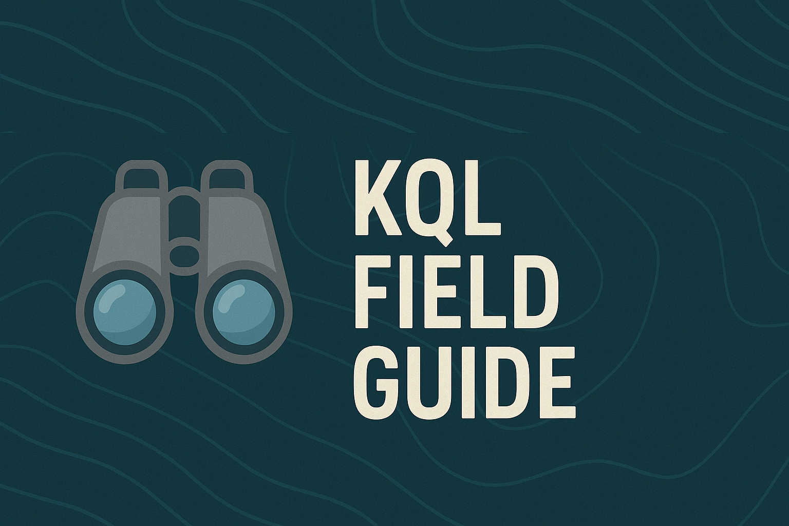
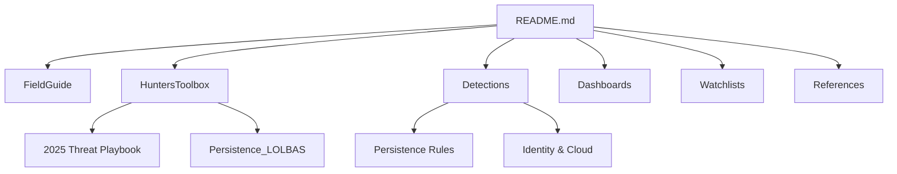
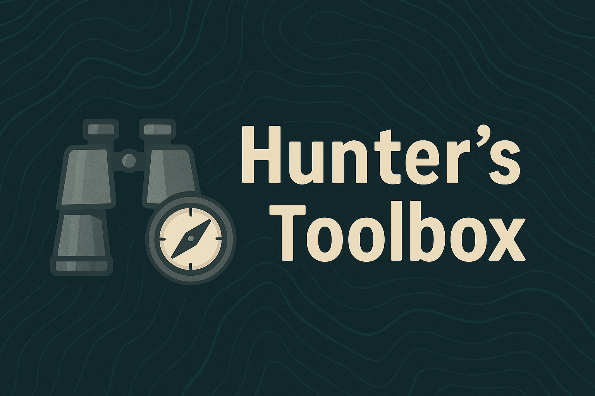

  

  
  
  

# 🔍 KQL Field Guide

A **comprehensive reference** for detection engineers and threat hunters working with Microsoft Sentinel and M365 Defender.
This repo combines **field guide material** (style, optimization, pivoting) with a curated **Hunter’s Toolbox** of queries, detections, and dashboards.

---

## 📖 Field Guide (Best Practices)

- [Style Guide](FieldGuide/StyleGuide/) – naming, commenting, readability
- [Optimization Patterns](FieldGuide/Optimization/) – performance tuning, `materialize()`, summarization
- [Pivoting Guide](Pivoting/README.md) – entity pivots across identity, device, process, and network

---

## 🔧 Hunter’s Toolbox

  

### 2025 Threat Playbook
- [MFA Fatigue / Prompt Bombing](HuntersToolbox/MFA_Fatigue.kql)
- [Password Spray](HuntersToolbox/Password_Spray.kql)
- [Impossible Travel](HuntersToolbox/Impossible_Travel.kql)
- [OAuth Consent / App Role Abuse](Detections/OAuth_Consent_or_App_Role_Assignment/query.kql)
- [Defender Tamper Events](HuntersToolbox/Defender_Tamper.kql)
- [Kerberoasting](HuntersToolbox/Kerberoasting.kql)
- [DCSync](HuntersToolbox/DCSync.kql)
- [RDP Lateral Movement](HuntersToolbox/RDP_LateralMovement.kql)
- [BEC – Inbox Rules / Exfil](HuntersToolbox/BEC_InboxRules.kql)

### Persistence & LOLBAS
- [Scheduled Tasks (T1053.005)](HuntersToolbox/Persistence_LOLBAS/ScheduledTasks.kql)
- [WMI Event Consumers (T1546.003)](HuntersToolbox/Persistence_LOLBAS/WMI_EventConsumers.kql)
- [Registry Run Keys (T1060)](HuntersToolbox/Persistence_LOLBAS/Registry_RunKeys.kql)
- [New Accounts & Group Adds (T1098)](HuntersToolbox/Persistence_LOLBAS/NewAccounts_GroupAdds.kql)
- [Service Install Startup (T1543)](HuntersToolbox/Persistence_LOLBAS/Service_Install_Startup.kql)
- [AAD Role Assignment Drift (T1098.004)](HuntersToolbox/Persistence_LOLBAS/AAD_Role_Assignment_Drift.kql)
- [Certutil Download (LOLBAS)](HuntersToolbox/Persistence_LOLBAS/Certutil_Download.kql)
- [Rundll32 Script Exec](HuntersToolbox/Persistence_LOLBAS/Rundll32_ScriptExec.kql)
- [MSHTA Script Exec](HuntersToolbox/Persistence_LOLBAS/MSHTA_ScriptExec.kql)
- [Regsvr32 Scripted COM](HuntersToolbox/Persistence_LOLBAS/Regsvr32_ScriptedCOM.kql)
- [Powershell Encoded Commands](HuntersToolbox/Persistence_LOLBAS/Powershell_Encoded.kql)
- [Bitsadmin Download](HuntersToolbox/Persistence_LOLBAS/Bitsadmin_Download.kql)

---

## 📊 Dashboards

- [Persistence & Evasion Seed](Dashboards/Persistence_Evasion.kql) – scheduled tasks, service installs, LOLBAS counts
- (More dashboards coming soon)

---

## ⚡ Detections

### Persistence Rules
- [Scheduled Tasks Rule](Detections/Persistence/ScheduledTasks/rule.yaml)  
- [Registry Run Keys Rule](Detections/Persistence/Registry_RunKeys/rule.yaml)  
- [Service Install Startup Rule](Detections/Persistence/Service_Install_Startup/rule.yaml)

### Identity & Cloud
- [OAuth Consent or App Role Assignment](Detections/OAuth_Consent_or_App_Role_Assignment/rule.yaml)

---

## 📂 Watchlists
- [VIP Users](Watchlists/vip_users.csv)
- [TOR Exit Nodes](Watchlists/tor_exit_nodes.csv)

---

## 📚 References
- Microsoft Sentinel Documentation
- M365 Defender Advanced Hunting Schema
- MITRE ATT&CK Matrix
- Kusto Detective Agency

---

## 🤝 Contributing
- Fork → branch → PR
- Add queries with:
  - `let` params for time/thresholds
  - Clear comments (intent, schema, expected output)
  - Performance notes & FP tuning guidance

---

## 📜 License
MIT
